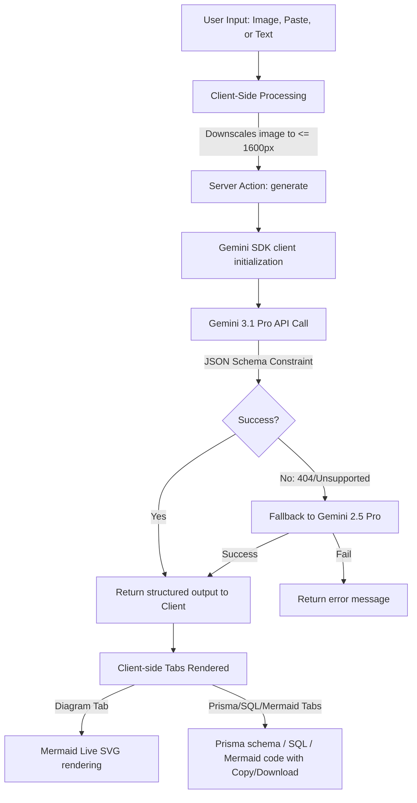

# Visual Whiteboard ──► Schema Builder

[](https://github.com/martian7777/Visual-Whiteboard_Schema-Builder/actions)
[](https://nextjs.org/)
[](https://react.dev/)
[](https://tailwindcss.com/)
[](https://aistudio.google.com/)

An AI-powered database architect tool that translates hand-drawn ER diagram sketches, clipboard screenshots, or plain-text app descriptions into ready-to-use schema files:
*   **Prisma Schema** (`schema.prisma`)
*   **PostgreSQL / Supabase DDL** (`schema.sql`)
*   **Mermaid.js Diagram** (`diagram.mmd`) with a live interactive SVG preview

---

## Table of Contents
1. [Core Features](#core-features)
2. [How It Works (Architecture)](#how-it-works-architecture)
3. [Technology Stack](#technology-stack)
4. [Project Structure](#project-structure)
5. [Getting Started & Setup](#getting-started--setup)
6. [CI/CD Pipeline & Code Quality](#cicd-pipeline--code-quality)
7. [Configuring Custom Models & Limits](#configuring-custom-models--limits)
8. [License](#license)

---

## Core Features

*   **Multimodal Input Support**:
    *   **Drag & Drop Upload**: Upload sketch images (`PNG`, `JPG`, `WEBP`, `GIF`). File sizes are optimized client-side to ensure fast uploads.
    *   **Clipboard Integration**: Instantly paste screenshots directly using `Ctrl+V` / `Cmd+V`.
    *   **Text Descriptions**: Describe your database structure or app idea in plain English (e.g., *"A SaaS tool with users, organizations, subscriptions, and billing logs"*).
*   **Production-Ready Output Code**:
    *   **SQL (PostgreSQL / Supabase)**: Generate clean tables with `UUID` primary keys, relationships, default values, and foreign keys, sorted correctly to resolve DDL constraints.
    *   **Prisma ORM**: Ready-made `schema.prisma` file complete with `datasource` and `generator` blocks.
    *   **Live Interactive Diagram**: Renders the generated Mermaid syntax as an SVG diagram on the client, letting you visually verify relations in real time.
*   **Quick Copy & Download**: Individual code views feature copy-to-clipboard and file download helpers.

---

## How It Works (Architecture)

The tool runs completely stateless and client-side focused. Here is the process flow:



### Detailed Execution Sequence

1.  **Client Processing**: If the user provides an image, it is drawn to an off-screen HTML canvas and resized down to a maximum dimension of 1600px. This reduces bandwidth usage and stays within Server Action payload limit constraints.
2.  **Next.js Server Action**: The React client calls the `"use server"` function `generate(input)` with the payload. This acts as a proxy to the Gemini API, keeping the API key secure on the backend.
3.  **Structured Output Constraint**: The action calls the Gemini SDK using a strict JSON schema contract built from `Zod` definitions. Gemini returns a response conforming precisely to the schema, avoiding markdown formatting code blocks.
4.  **Graceful Fallbacks**: If the primary reasoning model (`gemini-3.1-pro-preview`) is unavailable, the backend automatically retries using the fallback model (`gemini-2.5-pro`).
5.  **Mermaid Rendering**: The React client receives the schema JSON. The raw Mermaid string is rendered client-side using the `mermaid` npm package dynamic SVG renderer.

---

## Technology Stack

*   **Framework**: [Next.js 15 (App Router)](https://nextjs.org) with server-side actions.
*   **Runtime Library**: [React 19](https://react.dev) with custom Hooks.
*   **Styling**: [Tailwind CSS v4](https://tailwindcss.com) utilizing vanilla CSS tokens.
*   **AI Integration**: [@google/genai SDK](https://github.com/google/generative-ai-js) for model interface.
*   **Data Validation**: [Zod](https://zod.dev) for interface definition and response validation.
*   **Serialization**: [zod-to-json-schema](https://github.com/vcarl/zod-to-json-schema) to supply runtime JSON schema hints to Gemini.
*   **Visualizations**: [Mermaid.js v11](https://mermaid.js.org) for client-side ER diagram layouts.

---

## Project Structure

```bash
├── .github/
│   └── workflows/
│       └── ci.yml             # GitHub Actions CI/CD Pipeline
├── app/
│   ├── actions/
│   │   └── generate.ts        # Server Action proxy calling Gemini with Schema validations
│   ├── globals.css            # Styling tokens & Tailwind core import
│   ├── layout.tsx             # Root document container & HTML structure
│   └── page.tsx               # Main application client layout and UI shell
├── components/
│   ├── CodeBlock.tsx          # Code renderer with copy/download logic
│   ├── Dropzone.tsx           # Drag/drop, copy/paste, and downscaling handler
│   ├── Hero.tsx               # Header title and visual presentation panel
│   ├── InputPanel.tsx         # Sidebar selector tabs (Upload, Paste, Describe)
│   ├── MermaidPreview.tsx     # Client-side dynamic SVG Renderer using Mermaid
│   └── ResultTabs.tsx         # Results shell (Diagram, Prisma, SQL, Mermaid tabs)
├── lib/
│   ├── gemini.ts              # Google Gen AI client setup & model fallback configuration
│   ├── prompt.ts              # System prompts instructing database design conventions
│   └── schema.ts              # Zod schema definitions & JSON parser schemas
├── eslint.config.mjs          # Flat configuration ruleset for ESLint 9+
├── next.config.ts             # Server Action configurations (6MB body payload limit)
├── package.json               # Package dependencies & script runners
└── tsconfig.json              # TypeScript compilation rules
```

---

## Getting Started & Setup

### Prerequisites
*   Node.js v20.x or higher
*   An API Key from [Google AI Studio](https://aistudio.google.com/apikey)

### Installation

1.  **Clone the Repository**:
    ```bash
    git clone https://github.com/martian7777/Visual-Whiteboard_Schema-Builder.git
    cd Visual-Whiteboard_Schema-Builder
    ```

2.  **Install Dependencies**:
    ```bash
    npm install
    ```

3.  **Setup Environment Variables**:
    Copy the sample configuration file to create `.env` or `.env.local`:
    ```bash
    cp .env.example .env
    ```
    Open `.env` and fill in your Gemini API credentials:
    ```env
    GEMINI_API_KEY=your_gemini_api_key_here
    ```

4.  **Run Development Server**:
    ```bash
    npm run dev
    ```
    Open [http://localhost:3000](http://localhost:3000) in your browser to start using the whiteboard.

---

## CI/CD Pipeline & Code Quality

We use **GitHub Actions** to enforce code quality, compilation sanity, and test builds on every branch push and pull request.

### The CI Pipeline Workflow (`.github/workflows/ci.yml`)
When a change is pushed to `main`, `master`, or `dev`, GitHub Actions automatically:
1.  Sets up a clean **Ubuntu runner** with **Node.js v20**.
2.  Caches the `node_modules` structure to speed up runs.
3.  Installs clean package dependencies using `npm ci`.
4.  Runs **ESLint** validation checks (`npm run lint`).
5.  Checks for TypeScript compiler issues (`npx tsc --noEmit`).
6.  Builds the application (`npm run build`) to guarantee successful Next.js production compilations.

### Verification Commands (Local Runs)
Before opening a pull request, run the following verification pipeline locally:

```bash
# 1. Check code lint rules
npm run lint

# 2. Verify TypeScript type safety
npx tsc --noEmit

# 3. Test production build execution
npm run build
```

---

## Configuring Custom Models & Limits

### Model Adjustments
To update the models used by the generator, edit [lib/gemini.ts](lib/gemini.ts):
```typescript
// Define primary model (e.g. Gemini 3.1 Pro for vision & reasoning)
export const MODEL_ID = "gemini-3.1-pro-preview";

// Define fallback model if the primary is unavailable
export const FALLBACK_MODEL_ID = "gemini-2.5-pro";
```

### Server Action File Limits
Large screenshots may exceed standard server action request limits. We raise this limit to **6MB** inside [next.config.ts](next.config.ts):
```typescript
import type { NextConfig } from "next";

const config: NextConfig = {
  experimental: {
    serverActions: {
      bodySizeLimit: "6mb"
    }
  }
};

export default config;
```

---

## License

This project is licensed under the MIT License - see the [LICENSE](LICENSE) file for details.
